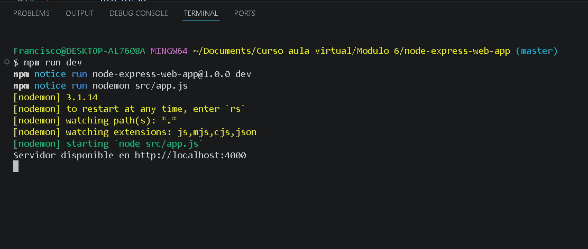
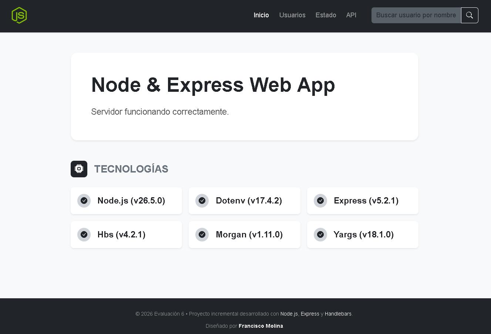
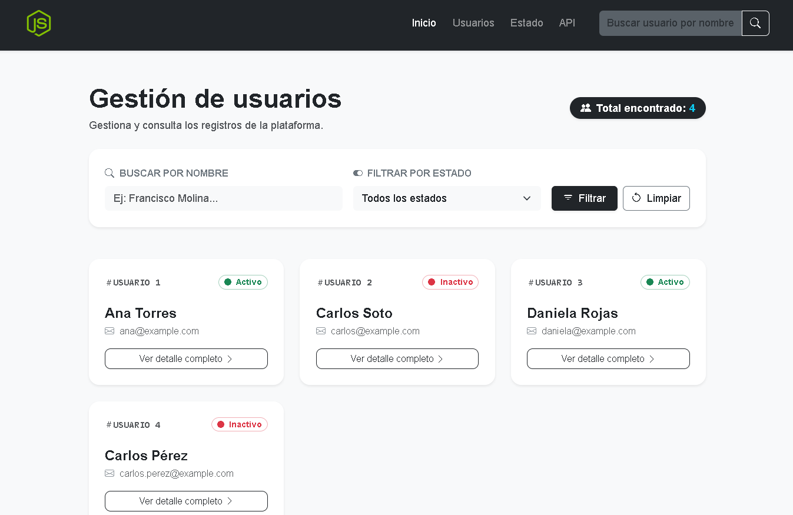
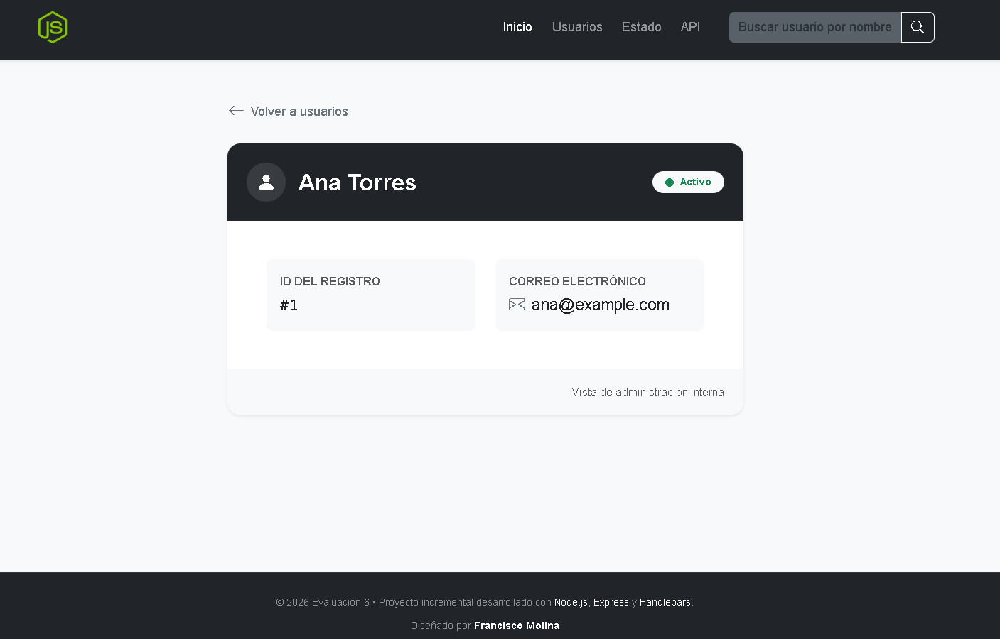
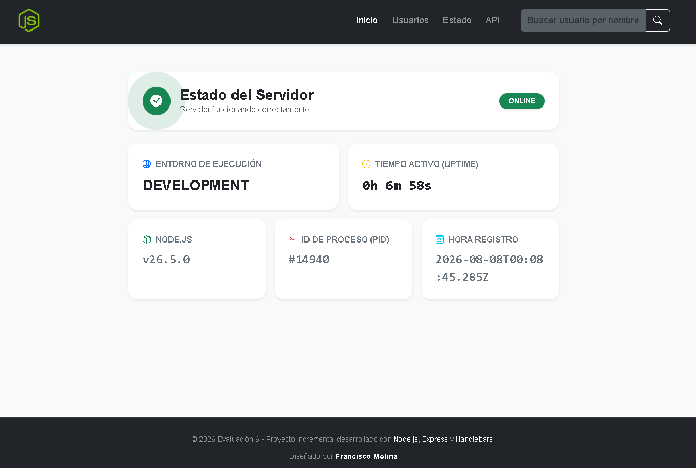
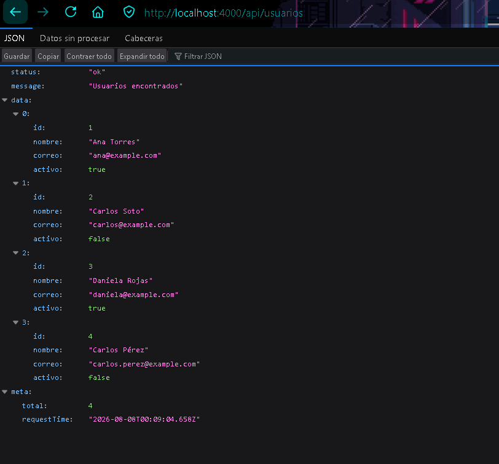

# Node & Express Web App

Proyecto del Módulo 6: TP Integrador JS - Francisco Molina


## Descripción

Aplicación que permite gestionar usuarios de archivo JSON con Node.js y Express

## Tecnologías usadas

- HTML
- CSS
- JavaScript
- Bootstrap
- Node.js
- NPM
- Express

## Conceptos aplicados

- Instalación Node + Express
- Gestión de paquetes.
- Uso de Módulos y Middleware en Express.js.
- Configuración del Servidor y Rutas en Express.
- Instalación, configuración y uso de Handlebars.
- Uso del módulo fs para manipular archivos.
- Registro de logs

## Cómo ejecutar el proyecto

1. Opcion 1
    - Descarga script bash inicio.sh desde la [carpeta docs del proyecto](https://github.com/franciscomolinacl/TP-Integrador-JS/blob/18e1000575b1518b6898f64566ae67bed562d7e6/docs/inicio.sh) o desde [Google Drive](https://drive.google.com/file/d/1dQs8TBvgu-DUv5oF8SdTTQ7mnZJ3vh4-/view?usp=sharing)
    - Ejecutar en VS Code con git o terminal (en Windows solo con git o Ubuntu si esta instalado y configurado)
    - Abrir en navegador [http://localhost:4000/](http://localhost:4000/)

2. Opcion 2
    - Clonar repositorio con siguiente comando:
    
            git clone https://github.com/franciscomolinacl/TP-Integrador-JS.git
    - Abrir carpeta descargada con VS code
    - Ejecutar el siguiente comando:
    
            npm init -y
    - Instalar dependencias con el siguiente comando:

            npm i express dotenv morgan hbs yargs
            npm i --save-dev nodemon
    - Revisar archivo package.json y ver que coincidan versiones. Pueden revisar con los siguientes comandos:

            node --version

            npm query "#express" | grep version | cut -d'"' -f4
            
            npm list dotenv --depth=0 --json | node -p "JSON.parse(require('fs').readFileSync(0)).dependencies?.dotenv?.version || ''"
            
            npm list nodemon --depth=0 --json | node -p "JSON.parse(require('fs').readFileSync(0)).dependencies?.nodemon?.version || ''"
            
            npm list morgan --depth=0 --json | node -p "JSON.parse(require('fs').readFileSync(0)).dependencies?.morgan?.version || ''"
            
            npm list yargs --depth=0 --json | node -p "JSON.parse(require('fs').readFileSync(0)).dependencies?.yargs?.version || ''"
            
            npm list hbs --depth=0 --json | node -p "JSON.parse(require('fs').readFileSync(0)).dependencies?.hbs?.version || ''"
    
    - Crear archivo .env con lo siguiente:
    
            PORT=4000
            NODE_ENV=development

    - Ejecutar el servidor con este comando:

            npm run dev

     - Abrir en navegador [http://localhost:4000/](http://localhost:4000/)

## Estructura del proyecto
```bash
Proyecto node-express-web-app/
├── docs
│     └── inicio.sh
│     └── capturas
│              ├── caption-servidor-iniciado.png
│              └── caption-web-inicio.png
├── node_modules (con todos los modulos necesarios)
├── public
│     ├── css
│     │    └── estilos.css
│     ├── img
│     │     ├── favicon.ico
│     │     └── logo.png
│     └── js
│          └── app.js
├── src
│     ├── config
│     │     └── handlebars.js
│     ├── controllers
│     │     ├── index.controller.js
│     │     └── usuarios.controller.js
│     ├── data
│     │     └── usuarios.json
│     ├── middlewares
│     │     ├── agregarContextoPeticion.js
│     │     ├── agregarDatosVista.js
│     │     ├── manejarErrores.js
│     │     ├── rutaNoEncontrada.js
│     │     └── validarIdUsuario.js
│     ├── routes
│     │     ├── index.routes.js
│     │     ├── usuarios.routes.js
│     │     └── web.routes.js
│     ├── services
│     │     └── usuarios.service.js
│     ├── utils
│     │     ├── archivos.js
│     │     ├── consola.js
│     │     ├── errores.js
│     │     ├── mensajes.js
│     │     ├── rutas.js
│     │     └── validaciones.js
│     ├── app.js
│     └── cli.js
├── views
│     ├── partials
│     │     ├── footer.hbs
│     │     ├── header.hbs
│     │     └── tarjetaUsuario.hbs
│     ├── error.hbs
│     ├── home.hbs
│     ├── usuario.hbs
│     └── usuarios.hbs
├── .env
├── .env.example
├── .gitignore
├── package-lock.json
├── package.json
└── README.md
```

## Anexos

### Servidor iniciado



### Web inicio



### Menu Usuarios



### Vista Usuario



### Estado servidor



### Vista API usuarios

